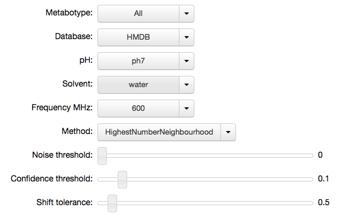

MetaboHunter
============

`MetaboHunter <http://www.nrcbioinformatics.ca/metabohunter/>`__ is a
web service for automated assignment of 1D raw, bucketed or peak picked
NMR spectra. Identification is performed in comparison to two publicly
available databases (`HMDB <http://www.hmdb.ca>`__,
`MMCD <http://mmcd.nmrfam.wisc.edu/>`__) of NMR standard measurements.
More information about the algorithm is available in the published
paper:

Tulpan, D., Leger, S., Belliveau, L., Culf, A., Cuperlovic-Culf, M.
(2011). `MetaboHunter: semi-automatic identification of 1H-NMR
metabolite spectra in complex
mixtures <http://www.biomedcentral.com/1471-2105/12/400>`__. BMC
Bioinformatics 2011, 12:400

I find the service useful to give a first-pass identification of
metabolites from 1D spectra, which can subsequently be confirmed or
combined with identification via other methods. I originally wrote a
Python interface as a standalone script, then as a
`Pathomx <http://pathomx.org>`__ plugin, and have now moved the code
into a reusable Python module with some extra IPython goodness. The
walkthrough below demonstrates using the service with standard settings,
passing a numpy array of ppms and peak heights. There is also a demo of
a simple IP[y] Notebook widget set that can be used to configure the
request.

The module and source code is available via
`PyPi <https://pypi.python.org/pypi/MetaboHunter/>`__ and
`Github <https://github.com/mfitzp/metabohunter/>`__.

Setup
-----

The module is on `PyPi <https://pypi.python.org/>`__ and has no funky
dependencies. You should be able to instal the ``metabohunter`` from the
command line:

::

    pip install metabohunter

To use the module simply import it. The main module object provides two
useful things: a ``request`` function that performs the request to the
MetaboHunter service and a ``IPyMetaboHunter`` which provides nice
widgets for IPython Notebooks and a synchronized config dictionary that
can be passed to requests.

.. code:: python

    import metabohunter as mh
    import numpy as np
    import os
    os.environ['http_proxy'] = ''
Input format
------------

To make a request to the MetaboHunter service you need to provide two
lists (or 1D numpy arrays) of ppm values (the x axis scale on an NMR
spectra) and peak heights (y axis). Here we create some dummy data using
an 50-element axis of 0-10 in 0.2 increments, together with a 50-element
series of peak heights generated randomly.

.. code:: python

    ppms = np.arange(0,10,0.2)
    peaks = np.random.random(50)*10
.. code:: python

    ppms

.. parsed-literal::

    array([ 0. ,  0.2,  0.4,  0.6,  0.8,  1. ,  1.2,  1.4,  1.6,  1.8,  2. ,
            2.2,  2.4,  2.6,  2.8,  3. ,  3.2,  3.4,  3.6,  3.8,  4. ,  4.2,
            4.4,  4.6,  4.8,  5. ,  5.2,  5.4,  5.6,  5.8,  6. ,  6.2,  6.4,
            6.6,  6.8,  7. ,  7.2,  7.4,  7.6,  7.8,  8. ,  8.2,  8.4,  8.6,
            8.8,  9. ,  9.2,  9.4,  9.6,  9.8])

.. code:: python

    peaks

.. parsed-literal::

    array([ 8.31680605,  6.04419835,  6.89353176,  6.00962915,  4.41208152,
            3.2333172 ,  1.39946687,  6.4614129 ,  6.20912024,  0.06888817,
            7.42894489,  6.7128017 ,  0.79111548,  8.85208481,  4.9710428 ,
            4.95762437,  9.82106628,  3.3606115 ,  8.71282185,  9.6313281 ,
            5.1396787 ,  6.90228616,  4.12455523,  3.71683751,  1.77995641,
            1.87159547,  5.43813402,  6.26325801,  9.17281811,  2.507874  ,
            0.64188688,  5.03782693,  6.93223808,  8.59120112,  2.95107901,
            9.70824585,  1.30386675,  1.02667654,  2.46923911,  9.02715511,
            2.42110673,  5.2022395 ,  8.79650171,  7.06068795,  9.45386543,
            4.38466017,  0.22570328,  3.25368676,  0.63608104,  6.98335382])

Performing a request
--------------------

The results are returned back in a list of the same length as the input
array. Mapped metabolites are represented by their `Human Metabolome
Database (HMDB) <http://hmdb.ca>`__ identifier whereas unmapped peaks
are represented by ``None``.

.. code:: python

    hmdbs = mh.request(ppms,peaks)
    hmdbs

.. parsed-literal::

    [None,
     None,
     None,
     None,
     None,
     None,
     None,
     None,
     None,
     None,
     'HMDB00766',
     None,
     'HMDB00210',
     'HMDB01919',
     'HMDB01919',
     None,
     None,
     'HMDB00210',
     None,
     None,
     None,
     None,
     None,
     None,
     None,
     None,
     None,
     None,
     None,
     None,
     None,
     None,
     None,
     None,
     'HMDB00763',
     'HMDB00617',
     'HMDB00763',
     'HMDB00259',
     None,
     None,
     None,
     None,
     None,
     None,
     None,
     None,
     None,
     None,
     None,
     None]

To throw away the None's and get the ppm values for the mapped
metabolites you can do something like:

.. code:: python

    [(ppm, hmdb) for ppm, hmdb in zip(ppms, hmdbs) if hmdb is not None]

.. parsed-literal::

    [(2.0, 'HMDB00766'),
     (2.4000000000000004, 'HMDB00210'),
     (2.6000000000000001, 'HMDB01919'),
     (2.8000000000000003, 'HMDB01919'),
     (3.4000000000000004, 'HMDB00210'),
     (6.8000000000000007, 'HMDB00763'),
     (7.0, 'HMDB00617'),
     (7.2000000000000002, 'HMDB00763'),
     (7.4000000000000004, 'HMDB00259')]

IPython Candy
-------------

To make the metabohunter module a bit nicer to work with from within
IP[y] Notebooks, the module provides a simple class for generating
widgets to control settings. The class is initialised with the default
settings for the request, however you can pass additional variables (any
of the keyword arguments allowed for ``request``).

.. code:: python

    mhi = mh.IPyMetaboHunter(confidence=0.1, tolerance=0.5)
Once the objet is created you can call ``.display()`` to render the
widgets in the current cell. Any changes to the variables are stored
back into the ``IPyMetaboHunter`` class object (here ``mhi``) and
available in subsequent calculations.

.. code:: python

    mhi.display()
    

.. code:: python

    mhi.settings

.. parsed-literal::

    {'confidence': 0.1,
     'database': 'HMDB',
     'frequency': '600',
     'metabotype': 'All',
     'method': 'HighestNumberNeighbourhood',
     'noise': 0.0,
     'ph': 'ph7',
     'solvent': 'water',
     'tolerance': 0.5}

The widgets manager makes the keyword arguments for the request
available via a ``kwargs`` property. To provide these to the request
function as keyword arguments we just need to unfurl it into the
function call using ``**``. Try adjusting the parameters above and
seeing how they affect the results when re-running the request.

.. code:: python

    mh.request(ppms,peaks,**mhi.kwargs)

.. parsed-literal::

    [None,
     None,
     None,
     None,
     None,
     'HMDB00172',
     'HMDB00011',
     'HMDB00518',
     'HMDB00510',
     'HMDB00510',
     'HMDB00518',
     'HMDB00510',
     'HMDB01547',
     'HMDB01547',
     'HMDB00101',
     'HMDB00208',
     'HMDB00192',
     'HMDB00162',
     'HMDB00014',
     'HMDB00122',
     'HMDB01401',
     'HMDB00272',
     'HMDB00902',
     'HMDB00085',
     None,
     None,
     'HMDB00215',
     None,
     'HMDB00393',
     None,
     None,
     None,
     None,
     None,
     'HMDB01392',
     'HMDB00617',
     'HMDB00303',
     'HMDB01406',
     None,
     None,
     'HMDB00232',
     'HMDB00902',
     None,
     None,
     None,
     None,
     None,
     None,
     None,
     None]

